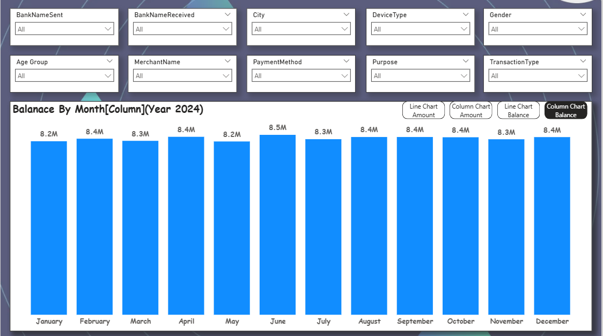
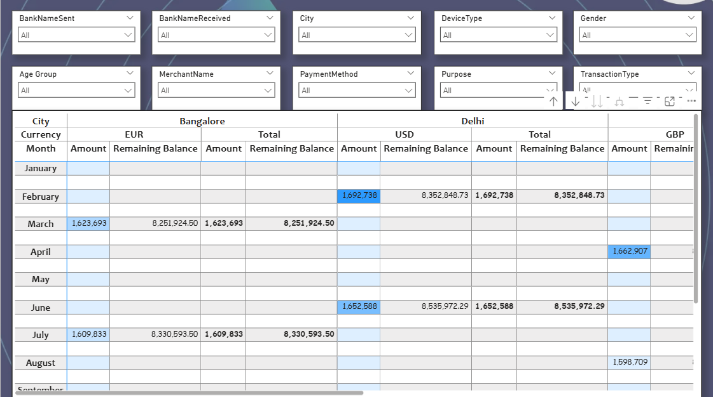

# upi-transaction-analysis
An interactive Power BI dashboard built on synthetic UPI transaction data to analyze balances, amounts, demographics, banks, and cities.
# 📊 UPI Transaction Analysis (Power BI)

An interactive **Power BI dashboard** built on synthetic UPI transaction data to analyze **balances, amounts, demographics, banks, and cities**.

## 🔹 Project Overview
- **Objective**: To analyze UPI transactions across banks, cities, devices, and customer segments.
- **Tools**: Power BI, SQL, Excel (for preprocessing).
- **Dataset**: Synthetic UPI transactions data for 2024.

## 🔹 Features
1. **Filters / Slicers**
   - BankNameSent, BankNameReceived, City, DeviceType, Gender, Age Group, MerchantName, PaymentMethod, Purpose, TransactionType.
2. **Visuals**
   - **Monthly Balance Trend** (Line & Column Charts)
   - **Transaction Amount by City & Currency**
   - **Demographic Insights (Age Group, Gender)**
   - **Merchant & Payment Method Analysis**
3. **KPIs**
   - Total Transactions
   - Average Transaction Size
   - Balance Trends (8.2M – 8.5M in 2024)

## 🔹 Insights
- June recorded the **highest balance (8.5M)**.
- Delhi had higher **USD transactions** compared to Bangalore.
- Merchant and device-type filters reveal **user behavior patterns**.

## 🔹 Screenshots

## 🔹 How to Run
- Open `upi_transaction.pbix` in **Power BI Desktop**.
- Or view static analysis in `/reports`.

---
